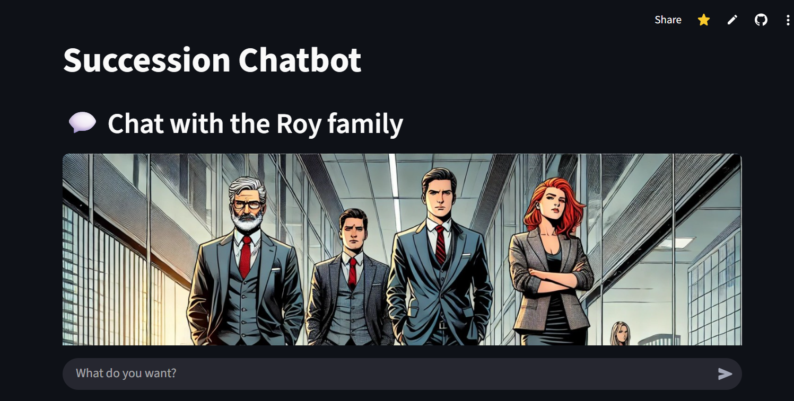
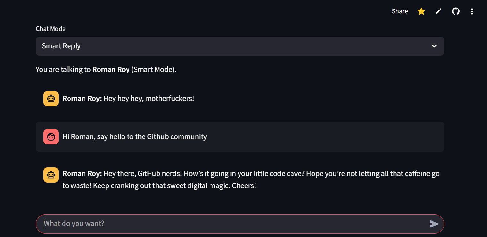

# Succession Chatbot

**Chat with the Roy family from _Succession_!**

This project builds an AI-powered chatbot that lets you have a live conversation with members of the Roy family — Logan, Kendall, Shiv, or Roman — by leveraging dialogue data from all four seasons, vector similarity (FAISS), and a fine-tuned OpenAI LLM. The web interface is built with Streamlit for a fast, interactive demo.

As broadly explored in this [Wall Street Journal article](https://www.wsj.com/arts-culture/television/the-weaponized-language-of-succession-eb97357f) , an element that clearly sets Succession apart from other TV shows is its exquisite attention to linguistic detail. This [Youtube video](https://www.youtube.com/watch?v=REhlyvtiIhQ) by the Nerdwriter, also beautifully highlights how characters use language to convey their personality. 

My inspiration to build this project comes from my deep fascination with how personality comes through in language. Word choice and speech can share so much about the inner workings of a person's mind. The result is a chatbot that **feels** like the characters in this show. Or, using shiv's words, "This project doesn’t just mimic speech; it channels the very soul of what makes the Roys, well, the Roys."

---

## 📺 Live Demo

[Try the Succession Chatbot here](https://succession-chatbot.streamlit.app/)

  
  

---

## 🔍 Features

- **Character Selection**: Choose which Roy family member you want to chat with.  
- **Smart Reply Mode**: Retrieves contextually relevant quotes using FAISS + SentenceTransformer embeddings to guide GPT responses.  
- **Roy Parrot Mode**: A keyword-matching fallback that mimics signature one-liners.  
- **Session History**: Maintains chat history during your session for full conversational context.  
- **Custom Prompt Engineering**: Uses targeted system prompts to replicate each character’s tone, including humor, sarcasm, and trademark curses.

---

## 🛠️ Tech Stack

- **Streamlit**: UI framework  
- **OpenAI API**: GPT-4o-mini for dynamic responses  
- **FAISS**: Vector similarity retrieval  
- **SentenceTransformer**: Embedding generation (`all-MiniLM-L6-v2`)  
- **PyMuPDF (fitz)**: Extracting and marking up italicized dialogue from PDFs  
- **Python**: Core scripting, regex heuristics, and pipeline glue

---

